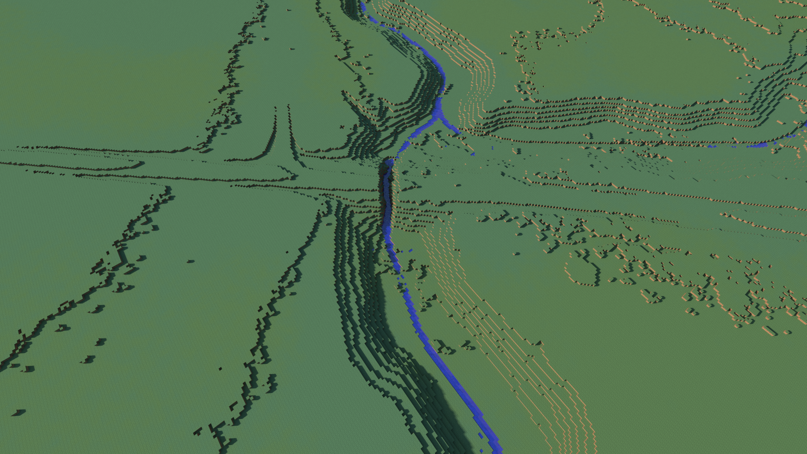

# Hydrologicall-correct-DEM-1m

# Table of  Contents

1. [Description](#Training-data)
2. [Environment](#Environment)
    1. [Build docker container](##build-docker-container)
    2. [Run docker container](##Run-docker-container)
3. [Data](#Data)
    1. [Ditches](##Ditches)
    1. [Digital elevation model](##Digital-elevation-model)
    1. [Road culverts](##Road-culverts)
    1. [Roads, Railroads and streams](##Roads,-Railroads-and-streams)
3. [Processing](#Processing)
    1. [Create isobasins](##Create-isobasins)
    1. [Clip input data with isobasins](## Clip-input-data-with-isobasins)

***
# Description
With the introduction of high-resolution digital elevation models, it is possible to use digital terrain analysis to extract small streams. In order to map streams correctly, it is necessary to remove errors and artificial sinks in the digital elevation models. This step is known as preprocessing and will allow water to move across a digital landscape. However, new challenges are introduced with increasing resolution because the effect of anthropogenic artefacts such as road embankments and bridges increases with increased resolution. These are problematic during the preprocessing step because they are elevated above the surrounding landscape and act as artificial dams. 

Sinks are defined as areas surrounded by cells with higher elevations, which prevent water from moving further. Thus, preprocessing of DEMs is important, especially because any errors in the input data will be amplified with each subsequent calculation. There are two commonly used methods to handle sinks: filling and breaching. A fill algorithm examines the cells surrounding a sink and increases the elevation of the sink cells to match the lowest outlet cell. A breaching algorithm instead lowers the elevation of cells along a path between the lowest cell in the sink and the outlet of the sink. This project will be build on the work by [Lidberg et al 2017](https://onlinelibrary.wiley.com/doi/10.1002/hyp.11385) and [Lidberg et al 2021](fixlink) by burning ditches and culverts into the DEM.

# Environment
A gdal docker image was used as a base for this project and the following python packages were installed: whitebox, rtree, pygeos, geopandas, tqdm, rasterio. Refer to the dockerfile for details on versions and environment setup. A complete docker image can be pulled from xxxx

## Build docker container
Navigate to the dockerfile and build container. In my case this was done like this:

    cd /mnt/Extension_100TB/William/GitHub/Hydrologically-correct-DEM-from-LiDAR/
    docker build -t dem .
## Run docker container
The data from our servers were mounted to the container over a 10 GBit network:\
**data** is the gneral directory where all the processing were done.\
**temp** is a 20 GB RAM disk where intermediate files were written to avoid reading and writing large amounts of data over the network.\
**national** is where the 1 m DEM tiles were located. This directroy was mounted seperatly to avoid moving large amounts of data to the "data" directory.\
**code** is the local github repository
 
    docker run -it  --mount type=bind,source=/mnt/GIS/hydrologically_correct_dem_1m/,target=/data --mount type=bind,source=/mnt/Extension_100TB/national_datasets/,target=/national --mount type=bind,source=/mnt/Extension_100TB/William/GitHub/Hydrologically-correct-DEM-from-LiDAR/,target=/code --mount type=bind,source=/mnt/ramdisk/,target=/temp dem:latest

# Data
## Digital elevation model
 
 The digital elevation model (DEM) had a resolution of 1 m and were downloaded by SLU. This data was a mix of the old LiDAR scan and the new LiDAR scan known as "laserdata skog nedladdning". It was stored under the **/national/Swedish1mDEM_old/tiles/** directory. A DEM resampled to 50x50m was used to create the watersheds or isobasins. It was stored under
**/data/dem50m/**

## Ditches
The ditches used for this project was created with the AI model described by xxxx. The ditch probability raster was used to burn in ditches into the DEM. The ditches were stored under **/national/ditches/1m/probability/**

## Road culverts
Culverts were downloaded as geopackages from the [Swedish traffic authority](https://lastkajen.trafikverket.se/login). The culvert data were stored in **/data/culverts/**

## Roads, Railroads and streams

Railroads, road and stream networks were extracted from the swedish property map created by [Swedish traffic authority](https://www.lantmateriet.se/). They were stored as lines that covered all of Sweden. The data were stored under **/data/fastighetskartan/2021-08-09/delivery/topo/fastighk/riks/**

# Processing
The entire process from raw data to hydrologically correct DEM can be run with the Master.sh batch script. Just store the data in the correct directories and update the mount paths in the Master.sh script to make it work on your system. Run the batchscript by navigating to its directory and type ./Master.sh

   

## Create isobasins

    python3 code/create_isobasins.py /temp/ /data/dem50m/dem_50m.tif /data/smhi/havsomraden2008_swe.shp 640000 /data/isobasins/isobasins.shp /data/isobasins/split/

1313 watersheds were produced

## Clip input data with isobasins

**Clip dem**

    python3 code/split_raster_by_isobasins.py temp/ /national/Swedish1mDEM_old/tiles/ /national/Swedish1mDEM_old/mosaic1m.vrt data/isobasins/split_isobasins/ data/clipraster/dem/ -32768

**Clip Ditches**

Fillburn failed on the tiles so a normal subtract will be used instead. Instead of burning the classified ditches I have decided to burn the probability instead. The probability was originaly between 0 and 100. I reclassified all probabilities under 50% to 0 and rescaled the values from 0-100 to 0-1. The reclassified raster were then subtracted from the original DEM with the pixel values. This meant that the min ditch burn depth is 0.5 m and the max burn depth is 1 m. 

    python3 code/reclassify_ditches.py /national/ditches/1m/probability/ /data/reclassified_ditches/

convert ditches to vrt and clip with isobasins

    python3 code/split_ditches_by_isobasins.py /temp/ /data/reclassified_ditches/ /data/ditches1m.vrt /data/isobasins/split/ /data/reclassified_ditches/ -32768

**Clip Roads and railroads**
Streams were burned across roads and railroads in order to let the water pass. A merged shapefile containing both roads and railroads were clipped by the outlines of the isobasins.

    python3 code/split_vector_by_isobasins.py /data/isobasins/split/ /data/fastighetskartan/2021-08-09/roads_railroads.shp /data/clipvector/roads_rail/

    
**Clip Streams**
Streams from the propertymap were also clipped to the outline of the isobasins.

    python3 code/split_vector_by_isobasins.py /data/isobasins/split/ /data/fastighetskartan/2021-08-09/delivery/topo/fastighk/riks/vl_riks.shp /data/clipvector/streams/

**Clip Culverts**
    python3 code/split_culvert_by_isobasins.py /data/isobasins/split/ /data/culverts/ /data/clipvector/culverts/

# Pre-processing

The pre-processing is done to create a hydrologically compatible DEM and was done in x stepps. 
    1. AI detected ditch channels were burned into the DEM .
    2. streams were burned across roads and railroads for a maximum of 50 meters.
    3. Road

    python3 code/preprocess.py /temp/ /data/clipraster/ /data/clipditches/ /data/clipculverts/ /data/cliproads/ /data/cliprailroads/ /data/clipstreams/ /data/breachedwatersheds/
    # krycklan
    python3 code/preprocess.py /temp/ /data/krycklan/dem/ /data/clipditches/ /data/clipculverts/ /data/cliproads/ /data/cliprailroads/ /data/clipstreams/ /data/krycklan/breacheddem/

    # Topographical modeling for hydrological features

    python3 code/Flowaccumulation.py /data/breachedwatersheds/ /data/D8pointer/ /data/D8flowaccumulation/
